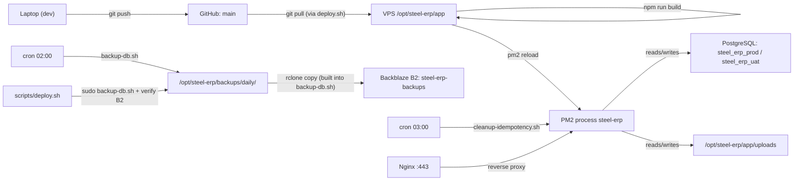
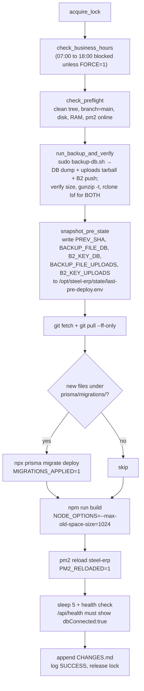

# Steel ERP — Operations Runbook

> **Purpose / الغرض:** the single trustworthy reference for day-to-day operations on the production VPS — deploy flow, normal checks, logs, and the rules that must never be broken.
>
> For failure scenarios, rollback, and disaster recovery see [`docs/DISASTER-RECOVERY.md`](docs/DISASTER-RECOVERY.md).
> For first-time server setup see [`DEPLOYMENT.md`](DEPLOYMENT.md). For pre-flip-the-switch checklist see [`DEPLOYMENT_CHECKLIST.md`](DEPLOYMENT_CHECKLIST.md).
> Hard rules live in [`.cursor/rules/production-safety.mdc`](.cursor/rules/production-safety.mdc).

**Server context / سياق السيرفر:** Hostinger VPS (KVM 2), Ubuntu 24.04, app at `/opt/steel-erp/app`, runs as user `deploy` under PM2 process `steel-erp` (single instance), PostgreSQL 16, Nginx in front.

---

## 1. System map / خريطة النظام



**Two databases share this VPS / قاعدتان على نفس السيرفر:**

- `steel_erp_prod` — production (الإنتاج).
- `steel_erp_uat` — pilot / staging (الاختبار). Which one the app talks to is decided by `DATABASE_URL` and `DIRECT_URL` in `/opt/steel-erp/app/.env.production`. **Always confirm before any migration.**

---

## 2. Daily ops cheatsheet / فحوصات يومية

Run any time to confirm the system is healthy. All read-only — safe.

```bash
pm2 status                                     # process up?  هل العملية شغّالة؟
curl -sf http://localhost:3000/api/health      # must contain "dbConnected":true
df -h /                                        # disk free   مساحة القرص
free -h                                        # RAM free    الذاكرة
sudo tail -20 /var/log/steel-erp-deploy.log    # last deploy
sudo tail -20 /var/log/steel-erp-backup.log    # last backup
sudo tail -20 /var/log/steel-erp-cleanup.log   # last cleanup cron
pm2 logs steel-erp --lines 50 --nostream       # recent app output
```

**Which DB am I currently pointed at? / على أي قاعدة التطبيق؟**

```bash
grep '^DATABASE_URL=' /opt/steel-erp/app/.env.production \
  | grep -o 'steel_erp_[a-z_]*'
```

---

## 3. Happy-path deploy / النشر الطبيعي

### 3.1 On the laptop / على الجهاز المحلي

```bash
# 1. New branch
git checkout -b feat/short-name

# 2. Develop + run locally
npm run dev

# 3. If schema changed: create a migration locally
npx prisma migrate dev --name short_descriptive_name

# 4. Commit, push, open PR against main
git push -u origin feat/short-name

# 5. Wait for CI to be green:
#    .github/workflows/ci.yml runs prisma validate, tsc, lint, vitest.
#    Merge PR to main only after green.
```

**شرح:** ما تشتغل مباشرة على `main`. كل تعديل بـ branch جديدة، وPR، وتنتظر CI.

### 3.2 On the server / على السيرفر

The repo's official entrypoint:

```bash
/opt/steel-erp/scripts/deploy.sh deploy
```

This is a thin wrapper around [`scripts/deploy.sh`](scripts/deploy.sh) and is the **only** sanctioned way to deploy. It enforces the maintenance window, invokes `scripts/backup-db.sh` (DB + uploads + off-site B2 push) and verifies all four points of [`production-safety.mdc`](.cursor/rules/production-safety.mdc) §7, snapshots state for rollback, and auto-reverts code on failure.

> **One-time setup on every new VPS:** symlink `/opt/steel-erp/scripts/deploy.sh → /opt/steel-erp/app/scripts/deploy.sh`, configure `rclone` for the `b2` remote, install the `/etc/sudoers.d/steel-erp-backup` entry, and create `/opt/steel-erp/scripts/.backup-env` (chmod 600). See [`DEPLOYMENT.md` §"Backups"](DEPLOYMENT.md). Until those are in place, use the manual fallback in §3.4.

### 3.3 What `deploy.sh deploy` does, line by line

Mirrors the actual flow in [`scripts/deploy.sh`](scripts/deploy.sh):



If anything fails after step `E`, an `ERR` trap auto-runs:

1. `git reset --hard PREV_SHA` to restore the code.
2. If `PM2_RELOADED=1`, re-runs `npm ci && npm run build && pm2 reload` on the restored tree.
3. If `MIGRATIONS_APPLIED=1`, **stops there** and logs the manual `pg_restore` command (using `BACKUP_FILE_DB` from the state file) plus the `tar -xzf` command for `BACKUP_FILE_UPLOADS` if present — the DB and uploads are never auto-rolled-back.

See [`docs/DISASTER-RECOVERY.md`](docs/DISASTER-RECOVERY.md) §2 for what to do next.

### 3.4 Manual fallback (current state of this VPS) / البديل اليدوي

Use this only while the `/opt/steel-erp/scripts/deploy.sh` symlink, the `sudoers.d/steel-erp-backup` entry, or the `rclone` configuration are not yet in place. Same order, manually guarded.

```bash
cd /opt/steel-erp/app

# 1. Confirm we are on main, clean, and which DB we will hit
git status
git rev-parse --abbrev-ref HEAD          # must be: main
grep '^DATABASE_URL=' .env.production | grep -o 'steel_erp_[a-z_]*'

# 2. Take a verified backup of THE DB the app currently points at
#    (see docs/DISASTER-RECOVERY.md §4 for the exact pg_dump command).

# 3. Pull
git fetch origin
git log HEAD..origin/main --oneline      # review what's coming
git pull --ff-only origin main

# 4. Install + Prisma client + migrations IF any new ones
npm ci
npx prisma generate
ls prisma/migrations | tail -5           # check for new directories vs. before
npx prisma migrate deploy                # only if new migrations exist

# 5. Build + reload
NODE_OPTIONS="--max-old-space-size=1024" npm run build
pm2 reload steel-erp                     # add --update-env if .env.production changed

# 6. Verify
sleep 5
curl -sf http://localhost:3000/api/health   # expect "dbConnected":true

# 7. Audit
sudo tee -a /opt/steel-erp/CHANGES.md > /dev/null <<EOF

## $(TZ=Asia/Damascus date '+%Y-%m-%d %H:%M %Z')
- Action: Manual deploy (PREV→NEW SHA above)
- Reason: <why>
- Commands: git pull, npm ci, prisma migrate deploy, build, pm2 reload
- Result: success, dbConnected:true
- Rollback: see docs/DISASTER-RECOVERY.md
EOF
```

---

## 4. Migrations / الترحيلات

### 4.1 Forward-only by design

`prisma migrate deploy` only **applies** pending migrations recorded in `prisma/migrations/`. It never auto-reverts. To go back, you restore the DB from the pre-migration backup (see [`docs/DISASTER-RECOVERY.md`](docs/DISASTER-RECOVERY.md) §4).

**ملاحظة:** Prisma لا تعمل rollback تلقائي للـ migrations في الإنتاج. الرجوع = استعادة من backup.

### 4.2 Detection logic

`scripts/deploy.sh` decides whether to run `migrate deploy` by:

```bash
git diff --name-only "$PREV_SHA" HEAD -- "prisma/migrations/"
```

If the diff is non-empty → `npx prisma migrate deploy` runs and `MIGRATIONS_APPLIED=1` is set.

### 4.3 Verify what's applied

```bash
# On the server, against the URL the app actually uses:
DB_URL=$(grep '^DATABASE_URL=' /opt/steel-erp/app/.env.production \
         | cut -d= -f2- | tr -d '"' | sed 's/?.*$//')
psql "$DB_URL" -c \
  "SELECT migration_name, finished_at FROM _prisma_migrations
   ORDER BY finished_at DESC LIMIT 5;"
```

### 4.4 Forbidden in production / ممنوع على الإنتاج

Per [`production-safety.mdc`](.cursor/rules/production-safety.mdc) §7 — never run on `steel_erp_prod`:

- `prisma migrate reset` / `prisma migrate dev` / `prisma db push` / `prisma db execute`
- `npm run db:reset` / `db:migrate` / `demo:*` / `reset-passwords`
- ad-hoc `DROP DATABASE`, `TRUNCATE`, unbounded `DELETE`

The only allowed schema mutation in production is `npx prisma migrate deploy`.

---

## 5. Maintenance window & cron schedule / نافذة الصيانة والجدولة

| When | Job | Script | Log |
|---|---|---|---|
| Daily 02:00 | DB + uploads backup **+ off-site push to B2** | `/opt/steel-erp/app/scripts/backup-db.sh` | `/var/log/steel-erp-backup.log` |
| Daily 03:00 | idempotency_keys cleanup | `/opt/steel-erp/app/scripts/cleanup-idempotency.sh` | `/var/log/steel-erp-cleanup.log` |
| Sunday (within 02:00 backup) | Weekly snapshot copy + B2 weekly push | `backup-db.sh` (DOW check) | same as backup |
| On demand | Deploy (re-runs `backup-db.sh` and re-verifies B2 before touching anything) | `scripts/deploy.sh deploy` | `/var/log/steel-erp-deploy.log` |

**Deploy maintenance window:** `deploy.sh` refuses to run between **07:00 and 18:00 Asia/Damascus** unless invoked with `FORCE=1` (emergency only — must be logged in `CHANGES.md`).

**Backup retention:** daily kept 7 days, weekly snapshots kept 4 weeks. Tunable via `BACKUP_KEEP_DAYS` / `BACKUP_KEEP_WEEKLY`.

---

## 6. Logs — where to look / السجلات

| Symptom | First file to read |
|---|---|
| App returning 5xx, slow, or unreachable | `pm2 logs steel-erp --lines 200 --nostream` and `~/.pm2/logs/steel-erp-error-*.log` |
| Recent deploy questions | `/var/log/steel-erp-deploy.log` (and the matching `CHANGES.md` entry) |
| Missing/failed backup | `/var/log/steel-erp-backup.log` |
| Cron cleanup failures (e.g. 401) | `/var/log/steel-erp-cleanup.log` |
| HTTP layer (TLS, 502, etc.) | `sudo tail -100 /var/log/nginx/error.log` and `access.log` |
| OS / systemd / disk pressure | `sudo journalctl -p warning --since "1 hour ago"` |

`pm2-logrotate` rotates PM2 logs daily (10 MB cap, 14 retained, compressed). System `logrotate.timer` rotates Nginx daily (14 retained, compressed).

---

## 7. Audit log discipline / سجل التغييرات

Every **mutating** action on the server (config edit, package install, UFW change, Prisma migration, env change, certbot renewal, manual data fix) MUST be appended to `/opt/steel-erp/CHANGES.md` in this exact format:

```
## YYYY-MM-DD HH:MM Asia/Damascus
- Action: <one-line summary>
- Reason: <why>
- Commands: <commands run, secrets redacted>
- Result: <success / output snippet / errors>
- Rollback: <how to undo>
```

Rules:

- **Append-only.** Never edit historical entries.
- **No secrets.** Never paste env values, DB passwords, or tokens. Use `stat` / `grep -c` to verify presence without revealing.
- `scripts/deploy.sh` writes its own entry on success and on auto-revert. Manual mutating actions outside the script must be logged the same way.
- Read-only diagnostics are not logged.

---

## 8. Golden rules / قواعد ذهبية (non-negotiable)

Mirror of the strict rules in [`.cursor/rules/production-safety.mdc`](.cursor/rules/production-safety.mdc) — kept here in concise form so they stay in front of you during a deploy.

1. **Never** run a Prisma migration on production without a verified backup taken seconds before.
2. **Never** `git pull && npm run build && pm2 reload` manually as separate commands on production. Use `scripts/deploy.sh deploy` (or §3.4 fallback while wiring up the symlink) — it is the only path that locks, backs up, snapshots state, and can auto-revert code.
3. **Never** use `prisma migrate reset`, `migrate dev`, `db push`, `db execute`, or any `db:reset` / `demo:*` script against `steel_erp_prod`. CI workflow guards against these too.
4. **Never** deploy without a saved `PREV_SHA` (= `/opt/steel-erp/state/last-pre-deploy.env` populated by `deploy.sh`). It is your lifeline for rollback.
5. **Every** rollback that touches the DB must restore **code + DB + uploads from the same point in time** (see [`docs/DISASTER-RECOVERY.md`](docs/DISASTER-RECOVERY.md) §4). Mismatched tiers cause silent corruption.
6. **Migrations should be forward-compatible** (expand → migrate → contract). Prefer additive nullable columns and double-write windows over destructive single-step changes. This makes most rollbacks "code only" and avoids needing a DB restore.
7. **Long-running operations** (>30 s) — `pg_restore`, `pg_dump` of full DB, `apt upgrade`, restore drills — MUST run inside `tmux new -s <name>`. SSH disconnects are silent killers.
8. **Never** edit files under `/etc/` (Nginx, sshd, postgresql.conf, UFW) without `sudo nginx -t` (where applicable) and a `<file>.bak.$(date +%Y%m%d-%H%M%S)` next to the original. Never use `/tmp` for backups — `systemd-tmpfiles` may clear it.
9. **Never** print `.env*`, `.backup-env`, SSH keys, or `~/.pgpass` to terminal, chat, logs, PRs, or `CHANGES.md`. Use `stat`, `wc -l`, `grep -c key=` to verify presence.
10. **Maintenance window** 07:00–18:00 Asia/Damascus — no deploys, no migrations, no risky restarts unless `FORCE=1` and the reason is logged in `CHANGES.md`.

---

## 9. When something is wrong / لما يصير شي غلط

Stop. Don't improvise. Open [`docs/DISASTER-RECOVERY.md`](docs/DISASTER-RECOVERY.md) and follow the decision tree. The two most common branches:

- **Failed during deploy** → §2 (auto-revert may have already run, check `MIGRATIONS_APPLIED`).
- **Failed after deploy "succeeded"** → §3 (use `scripts/deploy.sh rollback`, or manual restore in §4).
