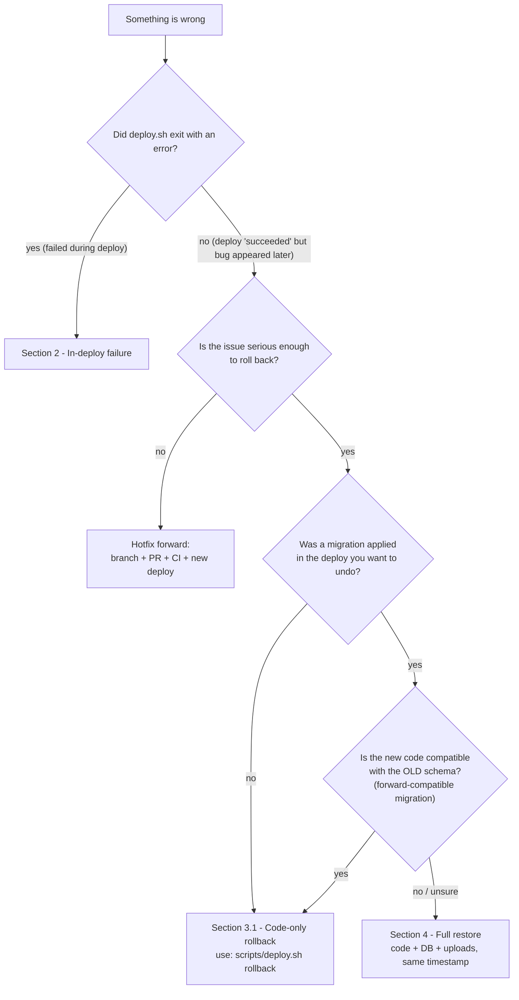
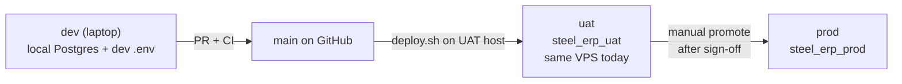

# Steel ERP — Disaster Recovery & Rollback Playbook

> **Purpose / الغرض:** the playbook to follow when a deploy fails or a bug surfaces in production. It tells you what is automatic, what is manual, and exactly which commands to run to get the system back to a known-good state — code, database, and uploads aligned.
>
> Pair this file with [`RUNBOOK.md`](../RUNBOOK.md) (normal ops) and the strict rules in [`.cursor/rules/production-safety.mdc`](../.cursor/rules/production-safety.mdc).

---

## 0. Read this first / اقرأ هذا أولاً

Three facts that drive every decision below:

1. **`prisma migrate deploy` is forward-only.** It applies pending migrations and never auto-reverts. Schema rollback = restore the DB from a backup taken **before** the migration.
2. **`scripts/deploy.sh` auto-reverts CODE only.** On failure it runs `git reset --hard PREV_SHA` and rebuilds. It will **never** auto-restore the DB. If migrations were applied, it stops and tells you to do it manually.
3. **A consistent restore = code + DB + uploads from the same point in time.** Mixing tiers (e.g. yesterday's DB with today's uploads, or new code with old DB) causes silent bugs that are far worse than downtime.

> **قاعدة بسيطة:** لما ترجع لـ DB قديمة، رجّع معها كود من نفس اللحظة، وملفات `uploads` من نفس التشغيلة.

---

## 1. Decision tree / شجرة القرار



When in doubt: take a fresh backup of the current state first, then proceed. You can always restore your way out — but only if you have the dump.

---

## 2. Failure during `deploy.sh` / فشل أثناء النشر

What the script automates is decided by two flags inside [`scripts/deploy.sh`](../scripts/deploy.sh):

- `MIGRATIONS_APPLIED` — set to `1` after `npx prisma migrate deploy` succeeds for this run.
- `PM2_RELOADED` — set to `1` after `pm2 reload steel-erp` succeeds for this run.

The `ERR` trap then:

1. Logs the failed line.
2. Runs `git reset --hard PREV_SHA`.
3. If `PM2_RELOADED=1`: runs `npm ci && npm run build && pm2 reload` on the restored tree.
4. If `MIGRATIONS_APPLIED=1`: prints the manual `pg_restore` recipe and exits — DB is left on the new schema.
5. Appends a FAILED entry to `/opt/steel-erp/CHANGES.md`.

### 2.1 Sub-case matrix

| Failed at | `MIGRATIONS_APPLIED` | `PM2_RELOADED` | Auto-revert | Operator follow-up |
|---|---|---|---|---|
| `check_preflight` (clean tree, branch, disk, RAM, pm2 online) | 0 | 0 | none — script exits before any change | Fix the listed precondition. |
| `run_backup_and_verify` (size / `gunzip -t` / `rclone lsf`) | 0 | 0 | none — code untouched | Fix backup pipeline before retrying. **Do not deploy without a verified backup.** |
| `git pull --ff-only` | 0 | 0 | none | Investigate diverged tree (someone hand-edited?). Resolve, then retry. |
| `npm ci` | 0 | 0 | code is the new SHA on disk but app still runs old PM2 process | `git reset --hard PREV_SHA` manually, then investigate `package-lock.json` / network. |
| `npx prisma generate` | 0 | 0 | same as above | Fix schema generation, then retry. |
| `npx prisma migrate deploy` | **0 or partial** | 0 | `git reset --hard PREV_SHA` | If a migration **partially** ran, see §2.2. Otherwise just retry once root cause is fixed. |
| `npm run build` | 0 or 1 | 0 | `git reset --hard PREV_SHA` | If `MIGRATIONS_APPLIED=1`, see §2.3 to decide DB action. |
| `pm2 reload` | 0 or 1 | 0 | `git reset --hard PREV_SHA` | Same as above. |
| Health check | 0 or 1 | **1** | `git reset --hard PREV_SHA` + `npm ci && build && pm2 reload` on old code | If `MIGRATIONS_APPLIED=1`, see §2.3. |

### 2.2 Partially-applied migration / فشل في منتصف الترحيل

`prisma migrate deploy` runs each migration in a transaction where possible, so a single migration is usually all-or-nothing. But:

- A multi-migration batch may apply migrations 1 and 2 successfully then fail on 3.
- Some `ALTER TABLE` operations on PostgreSQL cannot be wrapped in a single transaction (e.g. `CREATE INDEX CONCURRENTLY`).

If you suspect partial state:

```bash
# 1. Inspect which migrations Prisma considers applied
DB_URL=$(grep '^DATABASE_URL=' /opt/steel-erp/app/.env.production \
         | cut -d= -f2- | tr -d '"' | sed 's/?.*$//')
psql "$DB_URL" -c \
  "SELECT migration_name, finished_at, rolled_back_at, logs
   FROM _prisma_migrations
   ORDER BY started_at DESC LIMIT 10;"

# 2. If a row has rolled_back_at IS NULL but finished_at IS NULL → partial.
#    Easiest safe path: full restore from the pre-deploy backup (Section 4).
```

### 2.3 Auto-code-revert ran, but a migration was applied / تراجع الكود تم لكن الـ migration بقيت

This is the scenario the script explicitly logs:

```
WARNING: Prisma migrations were applied during this deploy.
Code has been reverted but the DB schema is on the new version.
```

Two valid responses:

- **(A) Roll forward.** Fix the bug in a new commit and `deploy.sh deploy` again. Prefer this when the migration was additive/forward-compatible (the old code can keep running fine on the new schema).
- **(B) Roll back the DB.** If old code is incompatible with the new schema, follow §4 (full restore from the pre-deploy backup the script already verified). The `BACKUP_FILE` is recorded in `/opt/steel-erp/state/last-pre-deploy.env`.

---

## 3. Post-deploy bug discovered later / عطل بعد نجاح النشر

The deploy "succeeded" hours or days ago. Now there is a bug.

### 3.1 Code-only rollback (preferred when safe)

Use the built-in subcommand. It reads `last-pre-deploy.env` to find `PREV_SHA` and rebuilds.

```bash
/opt/steel-erp/scripts/deploy.sh rollback
```

Internally it:

1. Acquires the deploy lock.
2. Loads `PREV_SHA` from `/opt/steel-erp/state/last-pre-deploy.env` (must exist).
3. Compares migrations between current `HEAD` and `PREV_SHA`. If any exist, it logs a loud WARNING and reminds you that DB is **not** reverted.
4. `git reset --hard PREV_SHA`, `npm ci`, `npm run build`, `pm2 reload`.
5. Health check; on failure it dies and tells you to intervene manually.
6. Appends to `CHANGES.md`.

> **Caveat / تنبيه:** the state file only points at the **most recent** deploy. If the bad deploy was several deploys ago, `rollback` will only walk back one step. For older targets, use the manual path (§3.2).

### 3.2 Manual rollback to an older commit

```bash
cd /opt/steel-erp/app

# 1. Pick the SHA (see §5 - finding the right commit)
TARGET_SHA="<full or short SHA>"

# 2. Take a fresh backup of CURRENT state first - so you can come back if needed
sudo /opt/steel-erp/app/scripts/backup-db.sh    # writes to /opt/steel-erp/backups/daily/

# 3. If migrations exist between TARGET_SHA and HEAD, decide DB action now (see §4)
git diff --name-only "$TARGET_SHA" HEAD -- prisma/migrations/

# 4. Roll the code
git fetch origin
git reset --hard "$TARGET_SHA"
npm ci
NODE_OPTIONS="--max-old-space-size=1024" npm run build
pm2 reload steel-erp --update-env

# 5. Verify
sleep 5
curl -sf http://localhost:3000/api/health   # expect "dbConnected":true

# 6. Audit
sudo tee -a /opt/steel-erp/CHANGES.md > /dev/null <<EOF

## $(TZ=Asia/Damascus date '+%Y-%m-%d %H:%M %Z')
- Action: Manual code rollback to $TARGET_SHA
- Reason: <why>
- Commands: git reset --hard $TARGET_SHA, npm ci, npm run build, pm2 reload
- Result: success, dbConnected:true
- Rollback: git reset --hard <previous-current-SHA> if needed
EOF
```

---

## 4. Full restore — code + DB + uploads (consistent snapshot) / استعادة كاملة

Use this when the bad deploy applied a migration that the old code cannot tolerate, or when data has been corrupted.

### 4.1 Pre-flight (do these every time)

```bash
# Long-running ops — inside tmux. Always.
tmux new -s restore

# Confirm which DB the app currently points at
grep '^DATABASE_URL=' /opt/steel-erp/app/.env.production \
  | grep -o 'steel_erp_[a-z_]*'

# Confirm a backup exists
ls -lah /opt/steel-erp/state/last-pre-deploy.env  # for the most recent deploy
ls -1t /opt/steel-erp/backups/daily/db_*.dump.gz       | head -5
ls -1t /opt/steel-erp/backups/daily/uploads_*.tar.gz   | head -5
```

### 4.2 Stop traffic / أوقف الكتابة

```bash
pm2 stop steel-erp
```

### 4.3 Pick a matched pair / اختر زوج متطابق

The backup script writes both files in the same run — match them by the **identical timestamp** in the filename.

```bash
# Example pair (same TIMESTAMP)
export DB_DUMP="/opt/steel-erp/backups/daily/db_steel_erp_prod_20260509-020001.dump.gz"
export UPL_ARCHIVE="/opt/steel-erp/backups/daily/uploads_20260509-020001.tar.gz"
export APP_ROOT="/opt/steel-erp/app"

# DB connection (without printing the password)
set -a
source <(grep -E '^(DATABASE_URL|DIRECT_URL)=' "$APP_ROOT/.env.production" \
         | sed 's/?.*$//' | sed 's/^/export /')
set +a
: "${DIRECT_URL:=$DATABASE_URL}"
```

### 4.4 Safety snapshot of CURRENT state / نسخة أمان قبل الكتابة

```bash
# Snapshot current DB (so you can roll forward again if restore is wrong)
SAFETY_TS=$(date +%Y%m%d-%H%M%S)
pg_dump -Fc "$DIRECT_URL" | gzip \
  > "/opt/steel-erp/backups/db_safety_pre_restore_${SAFETY_TS}.dump.gz"
gunzip -t "/opt/steel-erp/backups/db_safety_pre_restore_${SAFETY_TS}.dump.gz"

# Snapshot current uploads
sudo tar -czf "/opt/steel-erp/backups/uploads_safety_pre_restore_${SAFETY_TS}.tar.gz" \
  -C "$APP_ROOT" uploads
```

### 4.5 Restore the database / استعادة القاعدة

The backup format is `pg_dump -Fc` piped through `gzip`. Restore with `--clean --if-exists` so existing objects are dropped before re-import.

```bash
gunzip -c "$DB_DUMP" | pg_restore \
  --clean --if-exists --no-owner --no-acl \
  --dbname="$DIRECT_URL"
```

> If `pg_restore` complains about the URL having query params, strip `?…` (already done above) or use `-h -p -U -d` form with values from the same env file.

### 4.6 Restore the uploads / استعادة الملفات

```bash
mv "$APP_ROOT/uploads" "$APP_ROOT/uploads.before-restore.${SAFETY_TS}"
tar -xzf "$UPL_ARCHIVE" -C "$APP_ROOT"
sudo chown -R deploy:deploy "$APP_ROOT/uploads"
```

### 4.7 Align the code / مواءمة الكود

The DB you just restored knows it's at a specific point in `_prisma_migrations`. The code on disk must match — see §5.

```bash
cd "$APP_ROOT"
git fetch origin
git reset --hard "$PREV_SHA"   # from /opt/steel-erp/state/last-pre-deploy.env, or §5
npm ci
NODE_OPTIONS="--max-old-space-size=1024" npm run build
```

### 4.8 Bring it back up / تشغيل وفحص

```bash
pm2 start steel-erp
sleep 5
curl -sf http://localhost:3000/api/health   # expect "dbConnected":true
```

### 4.9 Audit / تسجيل

```bash
sudo tee -a /opt/steel-erp/CHANGES.md > /dev/null <<EOF

## $(TZ=Asia/Damascus date '+%Y-%m-%d %H:%M %Z')
- Action: Full restore — DB + uploads + code to snapshot ${DB_DUMP##*/}
- Reason: <why>
- Commands: pm2 stop; pg_restore --clean --if-exists; tar -xzf; git reset --hard; build; pm2 start
- Result: success, dbConnected:true
- Rollback: safety snapshots saved as db_safety_pre_restore_${SAFETY_TS}.dump.gz and uploads_safety_pre_restore_${SAFETY_TS}.tar.gz
EOF
```

---

## 5. Finding the right commit / تحديد الـ commit الصحيح

Ranked by reliability — try in order:

1. **`/opt/steel-erp/state/last-pre-deploy.env`** — written by every successful `deploy.sh deploy`. Contains `PREV_SHA`, `BACKUP_FILE_DB`, `B2_KEY_DB`, `BACKUP_FILE_UPLOADS`, `B2_KEY_UPLOADS` (and the legacy aliases `BACKUP_FILE`/`B2_KEY` pointing at the DB pair). **This is the single most reliable source.**

   ```bash
   sudo cat /opt/steel-erp/state/last-pre-deploy.env
   ```

2. **`/opt/steel-erp/CHANGES.md`** — `deploy.sh` writes a line containing `PREV_SHA=<sha> NEW_SHA=<sha>` for every deploy. Find the one matching the date you want.

   ```bash
   grep -B2 -A4 'PREV_SHA=' /opt/steel-erp/CHANGES.md | tail -40
   ```

3. **`/var/log/steel-erp-deploy.log`** — cross-reference timestamps with the backup filename you intend to restore.

   ```bash
   sudo grep -E 'Deploying [a-f0-9]+ → [a-f0-9]+' /var/log/steel-erp-deploy.log | tail -20
   ```

4. **`git log --before`** — when the timestamp of the backup is your only anchor.

   ```bash
   cd /opt/steel-erp/app
   git log --before="2026-05-09 02:00:00" -1 main
   ```

### 5.1 Prevent commit ambiguity / منع ضياع الـ commit

Future-proofing recommendations (not yet enforced — adopt when ready):

- **Tag every production release** `vYYYY.MM.DD-N` or `vX.Y.Z`. `deploy.sh` could push the tag after a successful deploy. Then "rollback to last week" becomes `git reset --hard v2026.05.02-1`.
- **Record the SHA inside every backup filename.** A simple change to `backup-db.sh` could append `_$(git -C /opt/steel-erp/app rev-parse --short HEAD)` to the dump name. Then a backup file inherently names the code version it pairs with.
- **Treat `last-pre-deploy.env` as critical state.** Back up `/opt/steel-erp/state/` alongside the DB, so you can recover the rollback pointer even if the disk is restored from an OS image.

---

## 6. `main` drifted ahead while server is on an older commit / فرع `main` تقدم والسيرفر متأخر

After a rollback, the server is intentionally pinned to an older `PREV_SHA`. New work has continued on `origin/main`. **A naive `git pull` is dangerous** — it would drag in newer code and run any new migrations against the older restored DB state.

### 6.1 Inspect the gap

```bash
cd /opt/steel-erp/app
git fetch origin
git log HEAD..origin/main --oneline                              # commits ahead
git diff --name-only HEAD origin/main -- prisma/migrations/      # new migrations?
```

### 6.2 Safe re-sync / مزامنة آمنة

The forward path is exactly the normal deploy:

1. **Fix the bug** that triggered the rollback in a new branch + PR + CI green + merge to `main`.
2. Take a **fresh** verified backup on the server.
3. Run `scripts/deploy.sh deploy`. It will detect the migrations between current `HEAD` and `origin/main` and apply them stepwise via `prisma migrate deploy`. Prisma's `_prisma_migrations` table tells it which ones are missing.
4. Verify health, append to `CHANGES.md`.

> Why this works: `prisma migrate deploy` looks at `_prisma_migrations` and applies only the missing ones in order. The "older" DB you restored knows exactly where it is, and Prisma walks it forward through every migration the new code introduces.

### 6.3 If the original bad deploy was reverted on Git too

If the team also reverted the bad commits on `main` (so `main` no longer contains them), the manual deploy is straightforward — `migrate deploy` will only see the corrective forward migrations, not the bad ones.

If the bad migrations were **squashed** or rewritten on `main` (rare, requires force-push and is discouraged for shared branches), coordinate with the team before deploying — Prisma's `_prisma_migrations` table may complain about checksum mismatches.

---

## 7. Restore drill (recommended monthly) / تمرين استعادة شهري

Untested backups are not backups. Once a month, verify a real restore against a throwaway database without touching prod or UAT.

```bash
tmux new -s drill

# 1. Pick the latest production dump
LATEST_DUMP=$(ls -1t /opt/steel-erp/backups/daily/db_steel_erp_prod_*.dump.gz | head -1)
echo "Restoring: $LATEST_DUMP"

# 2. Create a throwaway DB
sudo -u postgres psql -c "CREATE DATABASE steel_erp_restore_test;"

# 3. Restore into it
gunzip -c "$LATEST_DUMP" | sudo -u postgres pg_restore \
  --clean --if-exists --no-owner --no-acl \
  --dbname=steel_erp_restore_test

# 4. Sanity checks
sudo -u postgres psql -d steel_erp_restore_test -c "\dt"
sudo -u postgres psql -d steel_erp_restore_test -c \
  "SELECT migration_name, finished_at FROM _prisma_migrations ORDER BY finished_at DESC LIMIT 5;"
sudo -u postgres psql -d steel_erp_restore_test -c \
  "SELECT 'users' AS t, COUNT(*) FROM \"User\"
   UNION ALL SELECT 'customers', COUNT(*) FROM \"Customer\"
   UNION ALL SELECT 'orders', COUNT(*) FROM \"SalesOrder\";"

# 5. Drop it - never leave the throwaway DB sitting around
sudo -u postgres psql -c "DROP DATABASE steel_erp_restore_test;"

# 6. Log in CHANGES.md: "Restore drill - successful, retention OK".
```

If the restore fails or the row counts look wrong, **stop and treat the next backup window as a P1**: investigate `backup-db.sh` log, disk space, and the off-site copy.

---

## 8. Recommended professional architecture (target state) / المعمارية المستهدفة

Not blocking — adopt incrementally. Each item closes a gap that today is mitigated by discipline.

### 8.1 Three environments / ثلاث بيئات



- **dev:** local laptop with `npm run dev` and a developer-owned Postgres.
- **uat:** already exists on this VPS via `steel_erp_uat`. Use it for every change that touches the schema or core flows. Reset/seed via `npm run db:reset-admin` is allowed here only.
- **prod:** `steel_erp_prod`. Read-only for everyone except `scripts/deploy.sh`.

### 8.2 Branch protection / حماية الفرع

On GitHub:

- Protect `main` — require PR review + CI green + signed commits.
- Disallow force-push to `main` and to any tag matching `v*`.
- Optionally require linear history (no merge commits).

### 8.3 Release tags / علامات الإصدار

Every successful prod deploy gets a tag, e.g. `v2026.05.09-1`. This makes rollback a single command (`git reset --hard v2026.05.09-1`) and turns the deploy log into a release timeline. Easiest place to add it: at the end of `cmd_deploy` in `scripts/deploy.sh`.

### 8.4 Migration discipline (expand → migrate → contract) / منهج آمن للترحيلات

Designing migrations to be **forward-compatible** means the old code can keep running on the new schema, which makes most rollbacks "code only" and avoids needing a DB restore.

| Phase | What you do | Why |
|---|---|---|
| Expand | Add a new nullable column / new table. Deploy. Old code ignores it. | Old code keeps working. |
| Migrate | Backfill data. Update code to dual-read or dual-write. Deploy. | Both shapes work. |
| Contract | Drop the old column / table once nothing uses it. Deploy. | Clean schema, no rollback risk. |

Avoid in a single migration: dropping a column that the old code still reads, renaming a column without a compatibility window, or splitting a table without a backfill.

### 8.5 Off-site backup verification / التحقق من النسخ خارج السيرفر

The off-site push is now **built into `scripts/backup-db.sh`** itself: every run uploads the DB dump and the uploads tarball to `b2:steel-erp-backups/daily/` via `rclone copy`, then re-runs `rclone lsf` to confirm both keys landed. `scripts/deploy.sh` then re-verifies both keys before any code change. There is **no separate `rclone copy` cron**.

To make this end-to-end on a new VPS:

- Provision Backblaze B2 (or any S3-compatible target) and run `rclone config` for the `b2` remote.
- Optional: pin defaults in `/opt/steel-erp/scripts/.backup-env` (`B2_REMOTE`, `RCLONE_CONFIG`, retention windows). See [`DEPLOYMENT.md` §"Backups" → "اعتمادات في .backup-env"](../DEPLOYMENT.md).
- Once a quarter, perform §7 (restore drill) using the dump pulled **from B2**, not the local copy. Proves the off-site path actually works.

### 8.6 CI guardrails / حواجز CI

[`.github/workflows/ci.yml`](../.github/workflows/ci.yml) already runs `prisma validate`, `tsc --noEmit`, `npm run lint`, `npm test` against a bogus DATABASE_URL, and explicitly fails if a forbidden script (`db:reset`, `db:migrate`, `demo:*`, `reset-passwords`) is referenced. Keep that guard; if you ever add a deploy workflow, make it `workflow_dispatch` only (manual) — never auto-deploy on push.

---

## 9. Outstanding TODOs (operator) / مهام مفتوحة

These are real gaps in the current VPS setup that we haven't closed yet. Each is referenced from elsewhere in this playbook.

- [ ] Create the canonical entrypoint symlink: `ln -sf /opt/steel-erp/app/scripts/deploy.sh /opt/steel-erp/scripts/deploy.sh` and `chmod +x` it. Until then, §3.4 of [`RUNBOOK.md`](../RUNBOOK.md) is the manual fallback.
- [x] **Done in code:** `scripts/deploy.sh` now invokes `scripts/backup-db.sh` directly via `sudo -n` (single source of truth) and verifies BOTH the DB dump and the uploads tarball on B2. The standalone `backup.sh` wrapper is no longer used. Operator must install `/etc/sudoers.d/steel-erp-backup` — see [`DEPLOYMENT.md` §"6. سماح للمستخدم deploy"](../DEPLOYMENT.md).
- [ ] Configure `rclone` against Backblaze B2 (or chosen off-site target) so both `backup-db.sh` (during the daily cron) and `deploy.sh` (during pre-deploy verification) succeed. UAT/dev may set `SKIP_B2=1` — never on production.
- [ ] Schedule and document the monthly restore drill (§7). Add a calendar reminder; log every drill in `CHANGES.md`.
- [ ] Adopt release tags (§8.3) and protected `main` (§8.2) on GitHub.
- [ ] Make `/opt/steel-erp/CHANGES.md` writable by `deploy` (currently root-owned), or always run audit appends with `sudo tee -a` as documented.
