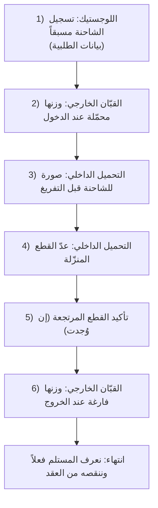

# قسم استلام البيلت المورّد للمعمل — خطة العمل

> وثيقة للعرض على الإدارة لأخذ الموافقة قبل البدء بالبناء.
> الهدف: شرح ما الذي سيحدث فعلياً على أرض الواقع، خطوة بخطوة، بدون أي تفاصيل تقنية.

---

## 1. الفكرة باختصار

نريد قسماً جديداً في النظام يسجّل **شاحنات البيلت** التي تصل إلى المعمل من الموردين.
كل شاحنة تأتي **محمّلة** بالبيلت، نزنها، تفرّغ حمولتها في المعمل، ثم تخرج **فارغة**.
من الفرق بين الوزنين نعرف **الكمية الفعلية التي استلمناها**.

بالإضافة لذلك، نسجّل **عقود الموردين**: كل مورّد متعاقد على كمية معيّنة، وكل شاحنة تصل تُنقص من رصيد عقده — فنعرف في أي لحظة كم استلمنا وكم بقي.

---

## 2. لماذا نحتاجه؟

- توثيق كل شاحنة بيلت تدخل المعمل (سائق، سيارة، وزن، عدد قطع).
- معرفة الكمية الفعلية المستلمة بدقّة (وزن داخل المعمل).
- مقارنة وزننا بالوزن المُرسَل بالطلبية لكشف أي خلل.
- **التحقق من مطابقة عدد القطع** المنزّل لما هو مسجّل بالطلبية، مع تنبيه فوري عند أي فرق.
- **قياس زمن التفريغ الداخلي** لكل شاحنة (لمتابعة الأداء).
- متابعة عقود الموردين: كم تعاقدنا، كم وصل، كم تبقّى.
- حفظ أوراق كل شحنة (إرسالية، كرت قبّان، أو أي ورقة) للرجوع إليها عند أي إشكال.

---

## 3. عقود الموردين

قبل وصول الشاحنات، نُسجّل **عقد المورّد** في النظام.

**من يُنشئ العقد؟ ومن يراه؟** صلاحية إنشاء العقد وصلاحية عرضه **منفصلتان**، وتُمنحان لأي موظف تختاره الإدارة وقت ما تشاء (يمكن تعديل الصلاحيات لكل مستخدم في أي وقت). الترتيب الافتراضي: الإدارة تُنشئ العقود، واللوجستيك يسجّل الشاحنات الواصلة ويرى العقود.

**ما الذي يُكتب في العقد؟**

| المعلومة | ملاحظة |
|----------|---------|
| رقم العقد | يولّده النظام تلقائياً |
| اسم المورّد | إلزامي |
| الوزن الإجمالي | وزن واحد متعاقد عليه لكل الأطوال معاً |
| عدد قطع 6 متر | عدّاد مستقل |
| عدد قطع 12 متر | عدّاد مستقل |
| التاريخ والملاحظات | اختياري |

> الأسعار والقيمة المالية **خارج هذه المرحلة تماماً** — العقد للمتابعة الكمّية فقط.

**مثال على عقد:** مورّد "X" — الوزن الإجمالي 1080 طن، عدد قطع 6م = 600، عدد قطع 12م = 400.

كلما وصلت شاحنة وفرّغت، يُنقص من العقد: **الوزن** من الإجمالي، و**عدد القطع** من عدّاد كل طول على حدة. فنرى دائماً: كم تعاقدنا، كم وصل، كم تبقّى.

---

## 4. سيناريو شاحنة بيلت من أولها لآخرها

العملية يتقاسمها **ثلاثة أشخاص**: موظف اللوجستيك، عامل القبّان الخارجي، عامل التحميل الداخلي.

### الخطوة 1 — تسجيل الشاحنة مسبقاً (اللوجستيك)

نُسجّل الشاحنة مقدماً ببيانات الطلبية:
- اسم السائق + رقم السيارة + (رقم السائق — اختياري)
- العقد الذي تتبع له
- **عدد القطع وطولها** كما في الطلبية (6م و/أو 12م)
- **الوزن المُرسَل بالطلبية** (ما أرسله المورّد)

### الخطوة 2 — وزن الشاحنة محمّلة (القبّان الخارجي)

عند دخول الشاحنة محمّلة، يأخذ عامل القبّان الخارجي **وزنها محمّلة**، ويُسجّل **وقت الدخول** تلقائياً.

### الخطوة 3 — صورة قبل التفريغ (التحميل الداخلي)

قبل البدء بالتفريغ، يلتقط عامل التحميل الداخلي **صورة للشاحنة**. هذه اللحظة هي **بداية احتساب زمن التفريغ الداخلي**.

### الخطوة 4 — عدّ القطع المنزّلة (التحميل الداخلي)

يعدّ العامل القطع التي نزلت فعلاً ويُدخلها. لحظة الإدخال هي **نهاية احتساب زمن التفريغ**.
- إذا طابق العدد ما هو مسجّل بالطلبية → الوضع سليم ونكمل.
- إذا ظهر **فرق** → يظهر **تنبيه فوري** وتتوقف العملية، فإمّا:
  - **إلغاء التفريغ**، أو
  - **الإكمال مع كتابة سبب إجباري** يُحفظ في السجل.

### الخطوة 5 — تأكيد القطع المرتجعة

قبل خروج الشاحنة، يُسأل عامل التحميل الداخلي: **هل يوجد قطع مرتجعة؟** فيُدخل عددها إن وُجدت (تخرج مع الشاحنة).

### الخطوة 6 — وزن الشاحنة فارغة وإغلاق العملية (القبّان الخارجي)

عند الخروج يأخذ القبّان الخارجي **وزنها فارغة**، ويُسجّل **وقت الخروج**، ويحسب النظام:
- **الكمية المستلمة فعلاً = الوزن محمّلة − الوزن فارغة**.
- ثم **يُنقص من العقد**: الوزن من الإجمالي، وعدد القطع الفعلي المقبول من عدّاد كل طول.

---

## 5. حالة القطع المرجوعة (المضروبة)

أحياناً تصل الشاحنة بـ 20 قطعة، وعند التفريغ نكتشف أن **3 قطع مضروبة** — نرفضها وتخرج الشاحنة وهي تحملها معها (لا نستلمها).

**الجميل في الموضوع أن الحساب يضبط نفسه تلقائياً:**

| | الوصف | الوزن |
|--|-------|-------|
| عند الدخول | الشاحنة + 20 قطعة | الوزن محمّلة |
| عند الخروج | الشاحنة + 3 قطع مرجوعة | الوزن فارغة |
| **النتيجة** | **وزن الـ 17 قطعة المقبولة فقط** | محمّلة − فارغة |

لأن القطع المرجوعة خرجت مع الشاحنة، فهي **لم تُحسب أصلاً** ضمن الكمية المستلمة. ونسجّل: العدد الكلي = 20، المرجوع = 3، المقبول = 17. فنعرف بوضوح ماذا استلمنا فعلاً.

> طبيعي أن يظهر فرق بسيط بين وزننا والوزن المُرسَل بالطلبية في هذه الحالة، لأن الطلبية تخص الـ 20 قطعة كاملة ونحن استلمنا 17 — وهذا متوقّع ومفهوم.

---

## 6. المقارنة مع وزن الطلبية

نُدخل **الوزن المُرسَل بالطلبية** عند تسجيل الشاحنة، فيُظهر النظام **الفرق** بينه وبين وزننا الفعلي عند الإغلاق.
- الفرق طبيعي ضمن حدود معقولة.
- إذا كان الفرق كبيراً، يُظهر النظام **تنبيهاً** للمراجعة (دون منع إتمام العملية).

---

## 7. الأوراق المرفقة

يمكن إرفاق **ملف واحد أو أكثر** مع كل شاحنة (إرسالية الميناء، كرت القبّان، أو أي ورقة). كلها **اختيارية ولا تمنع إغلاق العملية**، وبدون أنواع أو أسماء محددة — نرفق ما يلزم متى يلزم.
(صورة الشاحنة قبل التفريغ خطوة منفصلة ضمن العملية لأنها تبدأ احتساب زمن التفريغ.)

---

## 8. مثال رقمي كامل

عقد المورّد "X" — الوزن الإجمالي 620 طن، وعدد قطع 12م متعاقد عليه = 400 قطعة.

| الشاحنة | الوزن محمّلة | الوزن فارغة | الوزن المستلم | قطع 12م الكلي | المرجوع | المقبول | متبقّي الوزن | متبقّي قطع 12م |
|---------|-------------|-------------|---------------|----------------|---------|---------|--------------|------------------|
| شاحنة 1 | 37.5 طن | 6.5 طن | 31 طن | 24 | 0 | 24 | 589 طن | 376 قطعة |
| شاحنة 2 | 37.3 طن | 6.4 طن | 30.9 طن | 24 | 3 | 21 | 558.1 طن | 355 قطعة |

(الأرقام توضيحية. الوزن يُنقص من الإجمالي، والقطع من عدّاد كل طول.)

---

## 9. من يستطيع ماذا؟ (باختصار)

| الدور | الصلاحية |
|-------|-----------|
| الإدارة (المدير العام) | إنشاء وتعديل عقود الموردين + كل شيء |
| اللوجستيك | تسجيل الشاحنات الواصلة + عرض العقود |
| عامل القبّان الخارجي | وزن الشاحنة محمّلة عند الدخول، ووزنها فارغة عند الخروج وإغلاق العملية |
| عامل التحميل الداخلي | صورة الشاحنة قبل التفريغ، عدّ القطع، تأكيد المرتجع، رفع الأوراق |
| المالك | عرض فقط (متابعة) |

> ملاحظة: هذه التوزيعة افتراضية فقط — صلاحية إنشاء العقد وعرضه وتسجيل الشاحنات كلها **منفصلة**، وتستطيع الإدارة منحها أو سحبها من أي موظف في أي وقت.

---

## 10. ما هو خارج هذه المرحلة (لاحقاً)

- توزيع البيلت على حاويات/خزائن داخل المعمل (مستبعد حالياً بطلب الإدارة).
- ربط القسم بالحسابات المالية وتسعير المنتج النهائي.
- تقارير تفصيلية إضافية (تقرير استلام يومي، ملخص لكل مورّد) — تُضاف في مرحلة لاحقة.
- إدارة قائمة موردين كاملة (حالياً اسم المورّد يُكتب يدوياً في العقد).

---

## الخلاصة

نظام بسيط وواضح: نسجّل عقود الموردين، ونسجّل كل شاحنة بيلت من دخولها محمّلة حتى خروجها فارغة، فنعرف الكمية الفعلية المستلمة، ونتابع رصيد كل عقد، ونحفظ كل الأوراق المهمة — مع معالجة دقيقة لحالة القطع المرجوعة.

**المطلوب:** موافقة الإدارة على هذا السيناريو للبدء بالتنفيذ.
